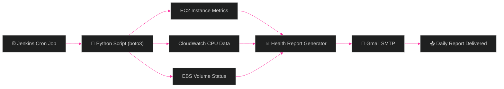
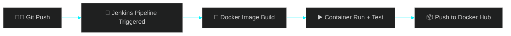

<!-- ═══════════════════════════════════════════════════════════════ -->
<!-- HERO -->
<!-- ═══════════════════════════════════════════════════════════════ -->


<div align="center">

[+%3D%3E+True;%3E+deploy(confidence%3DHigh))](https://git.io/typing-svg)

<br>

[](mailto:jagadeepkg18@gmail.com)
[](https://linkedin.com/in/jagadeepkg)
[](https://github.com/jagadeepkg)

</div>

<p align="center">
  
</p>

<!-- ═══════════════════════════════════════════════════════════════ -->
<!-- ABOUT -->
<!-- ═══════════════════════════════════════════════════════════════ -->

### 🧭 About Me


```python
class Jagadeep:
    def __init__(self):
        self.name = "Jagadeep KG"
        self.role = "Junior DevOps & Cloud Engineer"
        self.based_in = "Coimbatore, Tamil Nadu"
        self.stack = ["Python", "AWS", "Docker", "Jenkins", "Git"]
        self.learning = ["Kubernetes", "Terraform", "Ansible"]

    def motto(self):
        return "Automate the boring stuff. Ship it. Monitor it."
```

<br clear="right"/>

<div align="center">
  
</div>

<p align="center">
  
</p>

<!-- ═══════════════════════════════════════════════════════════════ -->
<!-- IMPACT AT A GLANCE -->
<!-- ═══════════════════════════════════════════════════════════════ -->

### 📊 Impact at a Glance

<div align="center">


</div>

<!-- ═══════════════════════════════════════════════════════════════ -->
<!-- ARCHITECTURE DIAGRAM — unique differentiator -->
<!-- ═══════════════════════════════════════════════════════════════ -->

### 🏗️ System I Built: AWS Infrastructure Health Reporter





<p align="center">
  
</p>

<!-- ═══════════════════════════════════════════════════════════════ -->
<!-- STATS DASHBOARD -->
<!-- ═══════════════════════════════════════════════════════════════ -->

### 📈 GitHub Dashboard

<div align="center">


<a href="https://github.com/jagadeepkg/aws-health-report">
  
</a>
<a href="https://github.com/jagadeepkg">
  
</a>

[](https://github.com/jagadeepkg)


</div>

<div align="center">

### 🐍 Contribution Snake


</div>

<p align="center">
  
</p>

<!-- ═══════════════════════════════════════════════════════════════ -->
<!-- SMALL UNIQUE TOUCHES -->
<!-- ═══════════════════════════════════════════════════════════════ -->

<div align="center">

<table>
<tr>
<td width="50%" valign="top" align="center">

**💭 Rotating Dev Quote**


</td>
<td width="50%" valign="top" align="center">

**😄 Refreshes Every Visit**


</td>
</tr>
</table>

</div>

<p align="center">
  
</p>

<!-- ═══════════════════════════════════════════════════════════════ -->
<!-- TROPHIES -->
<!-- ═══════════════════════════════════════════════════════════════ -->

<div align="center">


</div>

<!-- ═══════════════════════════════════════════════════════════════ -->
<!-- WORK EXPERIENCE -->
<!-- ═══════════════════════════════════════════════════════════════ -->

### 💼 Work Experience

<details open>
<summary><b>Postulate InfoTech — UI/UX Design Intern</b> · May 2025 · Coimbatore, Tamil Nadu</summary>
<br>

> `Wireframing` `Prototyping` `Usability Analysis` `UI/UX Design`

- Designed wireframes and interactive prototypes to improve digital product interaction flows
- Conducted usability analysis to identify friction points in existing interfaces
- Collaborated on design iterations to align user experience with product goals

</details>

<details>
<summary><b>Amypo Technologies — Gen AI Internship</b> · Dec 2024 · Coimbatore, Tamil Nadu</summary>
<br>

> `Generative AI` `Prompt Engineering` `Automation` `Workflow Optimization`

- Built hands-on experience with AI-driven solutions and generative model workflows
- Focused on model prompting techniques to improve output quality and reliability
- Explored automation opportunities to optimize repetitive workflow tasks

</details>

<!-- ═══════════════════════════════════════════════════════════════ -->
<!-- PROJECTS -->
<!-- ═══════════════════════════════════════════════════════════════ -->

### 🚀 Featured Projects

<div align="center">

| Project | Stack | Highlights |
|---|---|---|
| [**AWS Infrastructure Health Reporter**](https://github.com/jagadeepkg/aws-health-report) | Python, boto3, EC2, CloudWatch, EBS, Jenkins | Automated daily EC2/CloudWatch/EBS monitoring with email delivery via Jenkins cron |
| **Dockerized CI/CD — AWS Health Reporter** | Docker, Jenkins, AWS, Docker Hub | Auto-builds & pushes a Docker image to Docker Hub on every GitHub push |
| **Invoice Processing Automation Bot** | Python, pandas, openpyxl | Automates CSV invoice processing into Excel reports — **90% less manual entry** |

</div>

<!-- ═══════════════════════════════════════════════════════════════ -->
<!-- ACHIEVEMENTS + EDUCATION -->
<!-- ═══════════════════════════════════════════════════════════════ -->

### 🏆 Certifications

<div align="center">

| | Certification | Provider |
|---|---|---|
| ☁️ | Cloud Practitioner Essentials | FutureSkills Prime |
| 🎨 | Fundamentals of UI/UX | Coursera |
| 🐍 | Basics of Python | Great Learning |

</div>

### 🎓 Education

<div align="center">

| Degree | Institution | Year | Score |
|---|---|---|---|
| B.Sc Computer Science (Cognitive Systems) | Sri Krishna Arts and Science College, Coimbatore | 2023 – 2026 | CGPA: 7.3 |
| Senior Secondary School | Gem International Senior Secondary School, Palladam | 2022 – 2023 | 78.2% |

</div>

<p align="center">
  
</p>

<div align="center">


</div>


<!-- ═══════════════════════════════════════════════════════════════
  SETUP NOTES (delete this comment block once done)

  1) MERMAID DIAGRAMS — render natively on github.com. The dark-theme
     init directive at the top of each block keeps them black-background
     even in GitHub's light mode.

  2) GITHUB-READMDE-STATS THEMES — "chartreuse-dark" and streak theme
     "black-ice" were picked because they're true black-background
     themes that let the bg_color/title_color/icon_color overrides
     show through cleanly. If a card ever looks off, swap theme= for
     "dark" as a safe fallback — the color params will still apply.

  3) CONTRIBUTION SNAKE — needs a one-time GitHub Action in this repo
     (jagadeepkg/jagadeepkg). Create .github/workflows/snake.yml:

     ---
     name: Generate Snake
     on:
       schedule:
         - cron: "0 0 * * *"
       workflow_dispatch: {}
       push:
         branches: [ main ]
     jobs:
       generate:
         runs-on: ubuntu-latest
         permissions:
           contents: write
         steps:
           - uses: Platane/snk@v3
             with:
               github_user_name: jagadeepkg
               outputs: |
                 dist/github-contribution-grid-snake.svg
                 dist/github-contribution-grid-snake-dark.svg?palette=github-dark
           - uses: crazy-max/ghaction-github-pages@v4
             with:
               target_branch: output
               build_dir: dist
             env:
               GITHUB_TOKEN: ${{ secrets.GITHUB_TOKEN }}

     Commit it, then run once manually from the Actions tab.

  NOTE ON "BLACK THEME": GitHub controls the actual page background
  (light/dark mode is a site-wide user setting, not something a README
  can override). Every widget above is forced to a true black card via
  bg_color/background params so the profile reads as black-themed
  regardless of the viewer's GitHub mode — but plain markdown text and
  tables will still follow the visitor's own light/dark setting, since
  that part of the page isn't an image.
  ───────────────────────────────────────────────────────────────── -->
